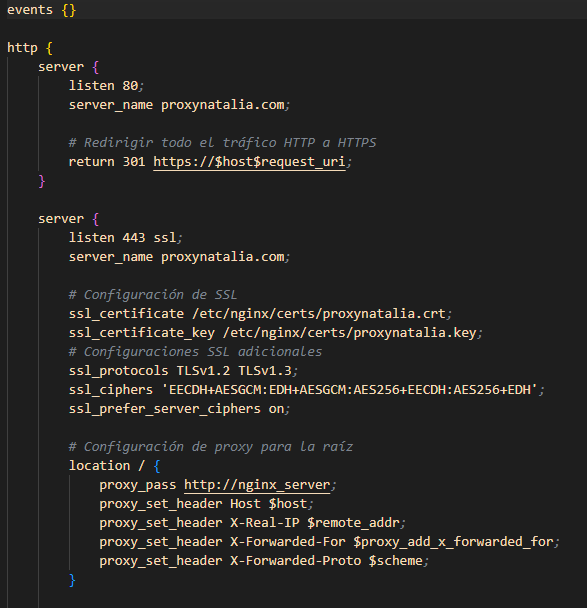
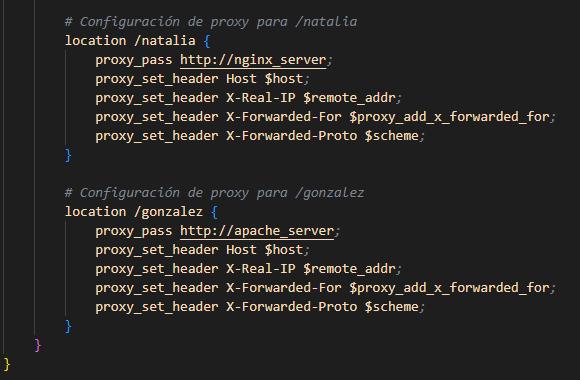
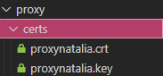
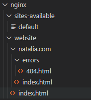
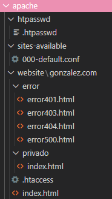
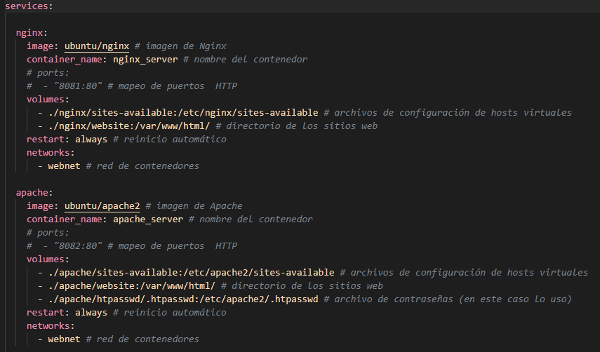
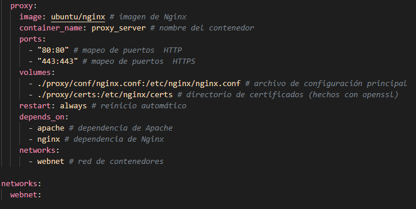
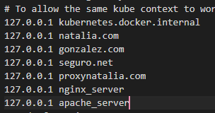
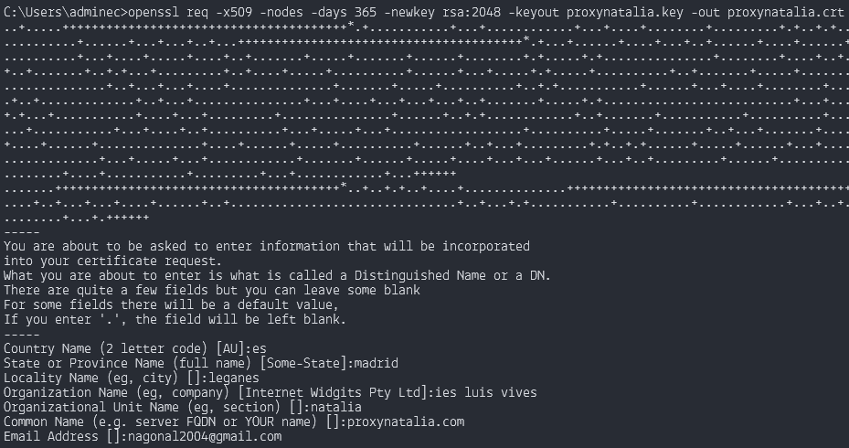

# Proxy-Inverso

### Carpeta proxy
Metemos dos carpetas:
* conf: donde metemos el fichero nginx.conf de nuestro sistema de Linux.

En el archivo nginx.conf, debemos configurar varios parámetros para nuestro servidor web. En el puerto 80:
1.	listen: especifica el puerto en el que se ejecutará el sitio web.
2.	server_name: define el nombre del dominio principal para el servidor.
3.	return 301: redirige todas las url que estén con http a la página segura de https.

En el puerto 443:
1. listen: especifica el puerto en el que se ejecutará el sitio web y su alias.
2. server_name: define el nombre del dominio principal para el servidor.
3. ssl_certificate y ssl_certificate_key: especifican la ubicación del certificado SSL y de la clave privada necesarios para establecer conexiones seguras.
4. ssl_protocols y ssl_ciphers: define los protocolos de seguridad que serán aceptados y los cifrados específicos para mantener la seguridad y compatibilidad con navegadores modernos. Además, ssl_prefer_server_ciphers asegura que el servidor dé prioridad a sus propios cifrados.
5. root: define el directorio raíz desde donde se servirán los archivos para este dominio. En este caso /var/www/seguro.net.
6. location: especifica una página personalizada para errores 401, 403, 404 y 500; y una página privada que solo se mostrará a los usuarios verificados.

* certs: donde metemos los ficheros del certificado y la clave de nuestra página segura.

 
### Carpeta nginx
Creamos los directorios:
* sites-available: donde se guardan todos los archivos de configuración de los sitios disponibles para Nginx.
 En este caso, solo tenemos el archivo default.
* website: donde creamos la estructura básica del sitio web para natalia.com en una carpeta "natalia.com" y el index.html por defecto.

### Carpeta apache

Creamos los directorios:
* htpasswd: donde metemos el fichero de la contraseña.
* sites-available: donde se guardan todos los archivos de configuración de los sitios disponibles para Nginx.
 En este caso, solo tenemos el archivo 000-default.conf.
* website: donde creamos la estructura básica del sitio web para gonzalez.com en una carpeta "gonzalez.com" y el index.html por defecto.
También incluiremos los ficheros necesarios para nuestra página web privada.

### Docker-compose

Creamos un fichero docker-compose. Debe de lucir de la siguiente forma:

 
En nuestro fichero hosts debemos añadir nuestro dominio con la IP de nuestro localhost.
 

Ejecutamos el comando openssl passwd. Ponemos la contraseña que queramos.

Copiamos la contraseña a un archivo .htpasswd con el nombre del usuario.

En la consola de OpenSSL, ponemos el comando openssl req -x509 -nodes -days 365 -newkey rsa:2048 -keyout proxynatalia.key -out proxynatalia.crt.
Ahora registraremos el país, provincia, localidad, organización, nombre, dominio y email.

Ejecutamos el Docker.

Al final de todo, nuestro directorio debe tener la siguiente estructura:

