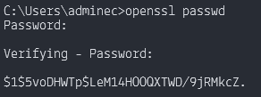
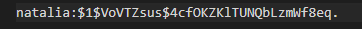
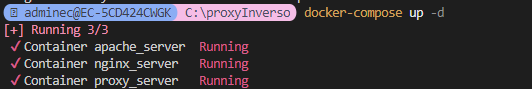
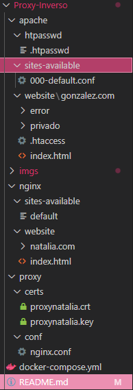

# Proxy-Inverso

Creamos una carpeta “proxy” donde metemos dos carpetas:
* conf: donde metemos el fichero nginx.conf de nuestro sistema de Linux.
* certs: donde metemos los ficheros del certificado y la clave de nuestra página segura.

 
Creamos el directorio nginx, donde creamos los directorios:
* sites-available: donde se guardan todos los archivos de configuración de los sitios disponibles para Nginx.
 En este caso, solo tenemos el archivo default.
* website: donde creamos la estructura básica del sitio web para natalia.com en una carpeta "natalia.com" y el index.html por defecto.

Creamos el directorio apache, donde creamos los directorios:
* htpasswd: donde metemos el fichero de la contraseña
* sites-available: donde se guardan todos los archivos de configuración de los sitios disponibles para Nginx.
 En este caso, solo tenemos el archivo 000-default.conf.
* website: donde creamos la estructura básica del sitio web para natalia.com en una carpeta "natalia.com" y el index.html por defecto.

 
En el archivo natalia.conf, debemos configurar varios parámetros para nuestro servidor web.
1.	listen: especifica el puerto en el que se ejecutará el sitio web.
2.	server_name: define el nombre del dominio principal para el servidor y su alias.
3.	root: define el directorio raíz desde donde se servirán los archivos para este dominio. En este caso /var/www/natalia.com.
4.	index: especifica que el archivo index.html será el archivo predeterminado que se cargará cuando un usuario acceda al dominio.
5.	location: especifica una página personalizada para errores 404
6.	error_log: define la ubicación donde se almacenarán los logs de errores.
7.  access_log: define la ubicación donde se almacenarán los logs de acceso.

 
Creamos un fichero docker-compose. Debe de lucir de la siguiente forma:

 
Debemos tener una carpeta scripts con nuestro fichero entrypoint.sh

 
En nuestro fichero hosts debemos añadir nuestro dominio con la IP de nuestro localhost.
 

## GONZALEZ.COM

En el directorio sites-available, agregamos el archivo seguro.conf.

 
En el archivo seguro.conf, debemos configurar varios parámetros para nuestro servidor web. En el puerto 80:
1.	listen: especifica el puerto en el que se ejecutará el sitio web.
2.	server_name: define el nombre del dominio principal para el servidor.
3.	return 301: redirige todas las url que estén con http a la página segura de https.

En el puerto 443:
1. listen: especifica el puerto en el que se ejecutará el sitio web y su alias.
2. server_name: define el nombre del dominio principal para el servidor.
3. ssl_certificate y ssl_certificate_key: especifican la ubicación del certificado SSL y de la clave privada necesarios para establecer conexiones seguras.
4. ssl_protocols y ssl_ciphers: define los protocolos de seguridad que serán aceptados y los cifrados específicos para mantener la seguridad y compatibilidad con navegadores modernos. Además, ssl_prefer_server_ciphers asegura que el servidor dé prioridad a sus propios cifrados.
5. root: define el directorio raíz desde donde se servirán los archivos para este dominio. En este caso /var/www/seguro.net.
6. location: especifica una página personalizada para errores 401, 403, 404 y 500; y una página privada que solo se mostrará a los usuarios verificados.

 
Creamos la estructura básica del sitio web para seguro.net en la carpeta websites. Cuenta con una página principal (index.html) que los usuarios verán al ingresar al dominio, y una página personalizada de error 404 (error404.html), error 401 (error401.html), error 403 (error403.html) y error 500 (error500.html). Aparte, cuenta con una página única para usuarios aptos
 

Añadimos el enlace simbólico del archivo .conf al fichero entrypoint.sh.

Creamos las carpetas certs y htpasswd

Ejecutamos el comando openssl passwd. Ponemos la contraseña que queramos.

Copiamos la contraseña a un archivo .htpasswd con el nombre del usuario.

En la consola de OpenSSL, ponemos el comando openssl req -x509 -nodes -days 365 -newkey rsa:2048 -keyout proxynatalia.key -out proxynatalia.crt.
Ahora registraremos el país, provincia, localidad, organización, nombre, dominio y email.

 
En nuestro fichero hosts debemos añadir nuestro dominio con la IP de nuestro localhost.
 

Ejecutamos el Docker.

Al final de todo, nuestro directorio debe tener la siguiente estructura:

